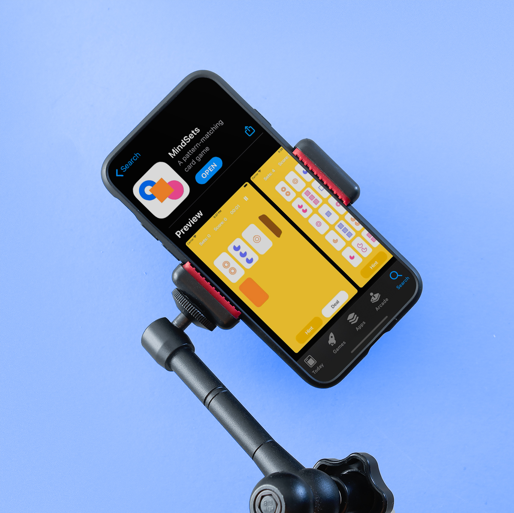

## Welcome to MindSets

MindSets game discovers the limits of attention. A pattern-matching card game loved by a lot of Americans. The playing deck consists of 81 unique cards that vary in 4 features: color, shading, and the number of shapes. The aim of the game is to find as many sets as you can!

